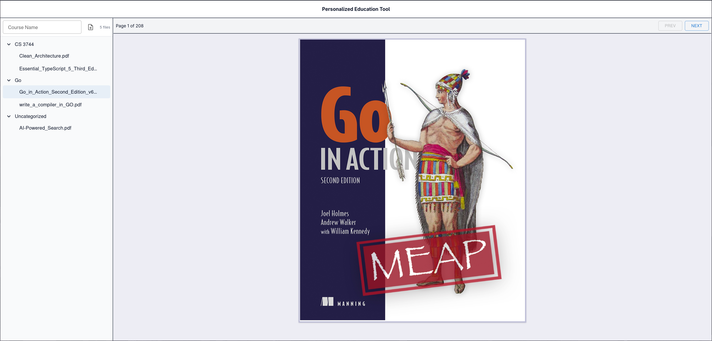

# **P**ersonalized **E**ducation **T**ool (PET)


A modern, full-stack document management system designed specifically for educational materials. PET enables students and educators to organize, upload, and view PDF documents with course-based categorization, providing a foundation for future AI-driven personalized learning experiences.

## Demo


*MVP demonstration showing PDF upload, organization, and viewing capabilities*

## Screenshots

### Default Interface


*Plain interface for document upload*

### Populated Interface


*Organized sidebar with course categorization and PDF viewer*

## ✨ Features

### Currently Working Features

- **PDF Document Management**: Upload, organize, and delete PDF files
- **Course-Based Organization**: Categorize documents by academic course or subject
- **Integrated PDF Viewer**: View documents directly in-browser
- **Real-time Updates**: Live loading states and error handling
- **File Tree Navigation**: Sidebar for easy document browsing

### API Endpoints

- `GET /api/files` - Retrieve all uploaded documents
- `POST /api/files` - Upload new PDF with course categorization
- `GET /api/files/:id/content` - Stream document content for viewing
- `DELETE /api/files/:id` - Remove specific documents
- `GET /api/health` - API health check with database status

## Technology Stack

### Frontend

- **React** - Modern UI library with latest features
- **TypeScript** - Type-safe development
- **Vite** - Fast build tool and development server
- **Tailwind CSS** - Utility-first styling framework
- **Material-UI** - Professional component library
- **react-pdf** - PDF rendering and viewing

### Backend

- **Node.js** - JavaScript runtime
- **Express.js** - Web application framework
- **TypeScript** - Server-side type safety
- **MongoDB** - Document database with Mongoose ODM
- **Multer** - File upload middleware
- **Docker** - Containerized database deployment

### Development Tools

- **Git** - Version control
- **Docker Compose** - Development environment orchestration

## Getting Started

### Prerequisites

- [Node.js](https://nodejs.org/) (v20+ recommended)
- [Docker](https://docker.com/) and Docker Compose
- [Git](https://git-scm.com/)

### Installation

1. **Clone the repository**

   ```bash
   git clone https://github.com/misha-ir/personalized-education-tool.git
   cd personalized-education-tool
   ```

2. **Backend Setup**

   ```bash
   cd backend
   cp .env.example .env
   # Edit .env file with your configuration
   npm install
   ```

3. **Frontend Setup**

   ```bash
   cd ../frontend
   npm install
   ```

4. **Database Setup**

   ```bash
   cd ../backend
   docker-compose up -d
   ```

### Running the Application

#### Manual Startup

1. **Start Backend** (from backend directory):

   ```bash
   cd backend
   docker-compose up -d  # Start MongoDB
   npm run dev           # Start backend server (http://localhost:3001)
   ```

2. **Start Frontend** (in new terminal, from frontend directory):

   ```bash
   cd frontend
   npm run dev           # Start frontend server (http://localhost:5173)
   ```

3. **Shutdown**:

   ```bash
   cd backend
   docker-compose down
   ```

#### Quick Start Scripts

For convenience, use the provided startup scripts:

**Unix/Linux/macOS:**

```bash
./start-dev.sh    # Start both backend and frontend
./stop-dev.sh     # Stop all services
./reset-dev.sh    # Reset database and restart (fixes sync issues)
```

**Windows:**

```cmd
start-dev.bat     # Start both backend and frontend
stop-dev.bat      # Stop all services
reset-dev.bat     # Reset database and restart (fixes sync issues)
```

### Environment Configuration

#### Backend `.env`

```ini
PORT=3001
MONGODB_URI=mongodb://127.0.0.1:27017/pet_dev
UPLOAD_DIR=uploads
```

#### Frontend `.env`

```ini
VITE_API_BASE=http://localhost:3001
```

## API Documentation

### File Upload

```http
POST /api/files
Content-Type: multipart/form-data

{
  "file": <PDF file>,
  "course": "Computer Science 101"
}
```

**Response:**

```json
{
  "id": "60f7b1b9b9f9f9f9f9f9f9f9",
  "name": "lecture-notes.pdf",
  "size": 1048576,
  "createdAt": "2025-01-13T18:30:00.000Z",
  "url": "/api/files/60f7b1b9b9f9f9f9f9f9f9f9/content",
  "course": "Computer Science 101"
}
```

### Get All Files

```http
GET /api/files
```

**Response:**

```json
[
  {
    "id": "60f7b1b9b9f9f9f9f9f9f9f9",
    "name": "lecture-notes.pdf",
    "size": 1048576,
    "createdAt": "2025-01-13T18:30:00.000Z",
    "url": "/api/files/60f7b1b9b9f9f9f9f9f9f9f9/content",
    "course": "Computer Science 101"
  }
]
```

### Health Check

```http
GET /api/health
```

**Response:**

```json
{
  "ok": true,
  "env": "development",
  "serverTime": "2025-01-13T18:30:00.000Z",
  "apiVersion": "1.0.0",
  "dbStatus": "connected",
  "dbName": "pet_dev"
}
```

## Known Issues & Limitations

### Current Limitations

- **File Format Restriction**: Currently supports PDF files only
- **Limited File Interaction**: Basic viewing capabilities without advanced features like annotations or search
- **UI/UX Improvements Needed**: Interface could benefit from enhanced user experience design
- **Accessibility**: Missing accessibility features for users with disabilities
- **Testing Coverage**: Comprehensive testing suite needed for production readiness

### Known Issues

- **Frontend/Backend Sync Issues**: Occasionally, the frontend and backend may get out of sync when restarting the application
  
  **Quick Fix:**

  ```bash
  # Clear backend uploads
  rm -rf backend/uploads/*
  
  # Clear database
  cd backend
  docker-compose exec mongo mongosh --eval "db.files.deleteMany({})" pet_dev
  
  # Or use the reset script
  ./reset-dev.sh  # Unix/Linux/macOS
  reset-dev.bat   # Windows
  ```

## Future Development Roadmap

Beyond the current MVP, PET is designed to evolve into a comprehensive, AI-driven learning platform with advanced features:

### Phase 1: Enhanced Core Functionality

- **Multi-Format Support**: Expand beyond PDFs to support DOCX, PPTX, images, and video files
- **Advanced Search**: Full-text search across all uploaded documents
- **Annotation System**: Add highlighting, notes, and bookmark capabilities
- **Improved UI/UX**: Modern, intuitive interface with accessibility compliance

### Phase 2: AI-Driven Study Pathways

- **Intelligent Content Analysis**: AI analysis of user-uploaded resources
- **Personalized Study Plans**: Adaptive learning pathways based on individual progress
- **Knowledge Assessments**: Automated quizzing and comprehension testing
- **Progress Tracking**: Detailed analytics on learning patterns and achievements

## Contact

**Project Maintainer**: misha-ir  
**Email**: [michael.rudnitsky.ivan@gmail.com](mailto:michael.rudnitsky.ivan@gmail.com)  
**GitHub**: [@misha-ir](https://github.com/misha-ir)  
**Project Link**: [https://github.com/misha-ir/personalized-education-tool](https://github.com/misha-ir/personalized-education-tool)

---
